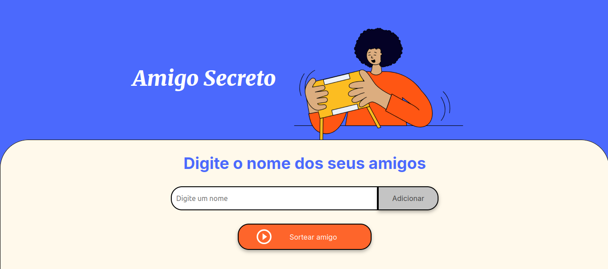

# Challenge Amigo Secreto - Alura + ONE

<div align="center">
  
</div>

## Descrição do Projeto
Este projeto foi desenvolvido como parte do **Challenge Amigo Secreto** oferecido pela Alura em parceria com o programa **Oracle Next Education (ONE)**. O objetivo é praticar **lógica de programação** e **manipulação do DOM**.


## Status do Projeto


## 🚀 Funcionalidades

- Adicionar amigos a uma lista.
- Exibir a lista de amigos cadastrados.
- Sortear aleatoriamente um amigo da lista.

## 🛠️ Tecnologias utilizadas

- **HTML5**  
- **CSS3**  
- **JavaScript**

## :rocket: Como Rodar o Projeto

### 1️⃣ **Clone este repositório:**
```bash
git clone git@github.com:GerlandioBernardo/Challenge-amigo-secreto-ONE.git
```

### 2️⃣ **Acesse a pasta do projeto:**
```bash
cd Challenge-amigo-secreto-ONE
```
### 3️⃣ Execute o projeto 
- Localize o arquivo **`index.html`**.  
- Clique duas vezes sobre ele **ou** abra manualmente no navegador de sua preferência.  

💡 **Dica:** utilize a extensão **Live Server** do VS Code para executar em um servidor local. Isso garante recarregamento automático e evita problemas de cache.
